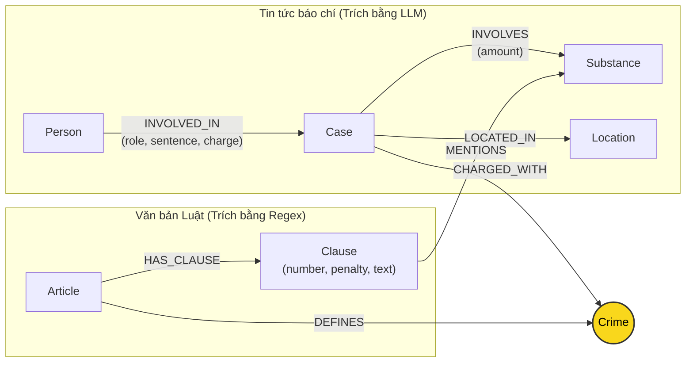

# Thiết kế Ontology — Day 19

**Họ tên:** Mai Quang Dũng  **MSSV:** 2A202602966

**Lựa chọn** (đánh dấu một):
- [x] Dùng ontology gợi ý (có tinh chỉnh tối ưu cho truy vấn multi-hop và trích xuất)
- [ ] Tự thiết kế (xét bonus +15, xem `SUBMISSION.md`)

> Hướng dẫn: `LAB_GUIDE.md` Bước 2. Bản thiết kế dưới đây mô hình hóa đầy đủ thực thể và quan hệ trong hệ thống GraphRAG nối 2 cơ sở tri thức (Luật và Tin tức ma túy).

## 1. Sơ đồ

*Ghi chú: Node `Crime` (màu vàng) là **Node cầu nối (Bridge Node)** trung tâm kết nối giữa hai cơ sở tri thức.*

## 2. Entity types (node labels)

| Label | Ý nghĩa | Khóa định danh (`MERGE` theo) | Properties | Lấy từ KB nào | Trích bằng (regex / LLM / khác) |
| --- | --- | --- | --- | --- | --- |
| `Article` | Điều luật cụ thể trong Bộ luật Hình sự hoặc Luật Phòng, chống ma túy | `id` (e.g. `"Điều 251 BLHS"`) | `id`, `title`, `law`, `doc_id` | KB Luật (`data/drug_law/`) | Regex (`parse_law_article`) |
| `Clause` | Khoản quy định mức phạt và tình tiết định khung | `id` (e.g. `"Điều 251 BLHS khoản 1"`) | `id`, `number`, `penalty`, `text`, `doc_id` | KB Luật (`data/drug_law/`) | Regex (`parse_law_article`) |
| `Crime` | Tội danh chuẩn hóa (Node cầu nối nối 2 KB) | `name` (e.g. `"mua bán trái phép chất ma túy"`) | `name` | Cả hai KB | Tiêu đề Điều luật (Regex) + Báo chí (LLM + `link_entity`) |
| `Substance` | Tên chất ma túy hoặc tiền chất | `name` (e.g. `"Heroine"`, `"MDMA"`, `"Ketamine"`) | `name` | Cả hai KB | Regex từ danh mục chuẩn (Luật) + LLM (Tin tức) |
| `Case` | Vụ án / vụ việc phạm pháp ma túy cụ thể | `name` (tên ngắn của vụ việc) | `name`, `summary`, `date`, `location`, `doc_id`, `source_title` | KB Tin tức (`data/drug_news/`) | LLM (`extract_news_cases`) |
| `Person` | Cá nhân liên quan (bị cáo, bị can, nghi phạm) | `name` (họ tên đầy đủ) | `name`, `aliases` (biệt danh) | KB Tin tức (`data/drug_news/`) | LLM (`extract_news_cases`) |
| `Location` | Địa bàn xảy ra vụ việc hoặc nơi xét xử | `name` (tỉnh/thành phố) | `name` | KB Tin tức (`data/drug_news/`) | LLM (`extract_news_cases`) |

## 3. Relationships

| Type | Từ → Đến | Properties trên cạnh | Ý nghĩa |
| --- | --- | --- | --- |
| `DEFINES` | `Article` → `Crime` | (không) | Điều luật trong BLHS định nghĩa và chế tài tội danh cụ thể |
| `HAS_CLAUSE` | `Article` → `Clause` | (không) | Điều luật bao gồm các khoản phân định khung hình phạt |
| `MENTIONS` | `Clause` → `Substance` | (không) | Khoản luật quy định chế tài đối với loại chất ma túy cụ thể |
| `CHARGED_WITH` | `Case` → `Crime` | (không) | Vụ án bị cơ quan chức năng truy tố / xét xử về tội danh cụ thể |
| `INVOLVES` | `Case` → `Substance` | `amount` (khối lượng thu giữ) | Vụ án liên quan đến chất ma túy nào và số lượng/khối lượng bao nhiêu |
| `LOCATED_IN` | `Case` → `Location` | (không) | Địa bàn hành vi diễn ra hoặc nơi Tòa án xét xử |
| `INVOLVED_IN` | `Person` → `Case` | `role` (vai trò), `charge` (tội danh), `sentence` (mức án) | Cá nhân tham gia vào vụ án với tư cách, tội danh và mức án tuyên |

## 4. Node cầu nối giữa 2 KB

- **Node nào:** `Crime` (Tội danh ma túy, ví dụ: `"mua bán trái phép chất ma túy"`, `"vận chuyển trái phép chất ma túy"`, `"tổ chức sử dụng trái phép chất ma túy"`).
- **Vì sao chọn node này:**
  - Tội danh là thực thể pháp lý có tính quy chuẩn cao nhất có mặt ở cả hai nguồn dữ liệu.
  - Trong KB Luật, mỗi Điều ở Chương XX BLHS đều có tiêu đề quy chuẩn: `Điều 25x. Tội <tên tội danh>`.
  - Trong KB Tin tức, các bài báo phản ánh hoạt động xét xử hoặc bắt giữ tội phạm luôn nêu rõ tội danh mà đối tượng bị truy tố.
  - Nếu chọn `Substance` làm cầu nối, một chất như "Heroine" sẽ nối tới hàng chục Điều luật khác nhau (tàng trữ, vận chuyển, mua bán, sản xuất...), khiến truy vấn đi sai hướng hoặc bùng nổ dữ kiện thừa. Node `Crime` đảm bảo dẫn hướng chính xác vụ án về đúng Điều luật áp dụng.
- **Cách đảm bảo hai phía khớp tên:**
  - *Phía luật:* Trích xuất tên tội từ tiêu đề Điều (`title.split('. ', 1)[-1]`), xóa tiền tố `"Tội "` và chuyển về chữ thường thông qua `normalize_crime()`.
  - *Phía tin tức:* Đưa trực tiếp danh sách tội danh chuẩn (`DANH SÁCH TỘI DANH`) vào prompt yêu cầu LLM bắt buộc chọn đúng nguyên văn.
  - *Khâu liên kết (`link_entity`):* Chuẩn hóa cả hai phía; nếu không khớp chính xác 100%, áp dụng thuật toán so khớp mờ `difflib.get_close_matches(cutoff=0.8)` nhằm xử lý các lỗi chính tả phổ biến trong báo chí tiếng Việt (ví dụ: biến thể dấu `"tuý"` vs `"túy"`, viết hoa/thường, khoảng trắng thừa).
- **Khi nào cầu gãy, và bạn xử lý thế nào:**
  - Cầu gãy khi:
    1. Bài báo tường thuật hành vi chung chung hoặc giai đoạn điều tra ban đầu chưa xác định được tội danh chuẩn.
    2. LLM trích xuất một tên tội tự chế không đủ độ tương đồng 0.8 so với danh mục BLHS.
    3. Tội danh nằm ngoài phạm vi các Điều luật ma túy đã crawl.
  - Cách xử lý: Khi không tìm được match tin cậy, hàm `link_entity` trả về `None` (không ép nối bừa để tránh dẫn đến điều luật sai). Hệ thống vẫn lưu trữ thông tin vụ án trong Neo4j với `doc_id`, và cơ chế Hybrid GraphRAG vẫn sử dụng vector search trên các đoạn văn bản (chunks) để bổ khuyết câu trả lời.

## 5. Competency questions

Dưới đây là đường đi Cypher được thiết kế tương ứng với 6 câu hỏi kiểm thử trong `data/benchmark_kg.json`:

| Câu | Đường đi (Cypher pattern) | Trả lời được? |
| --- | --- | :---: |
| Q1 | `(:Article {title:'Luật Phòng, chống ma túy'})-[:HAS_CLAUSE]->(:Clause)` *(Tra cứu định nghĩa tiền chất trong luật)* | Được |
| Q2 | `(:Person)-[r:INVOLVED_IN]->(:Case {name:'Vụ đường dây mua bán hơn 36kg ma túy...'})` *(Lọc `r.sentence CONTAINS 'tử hình'`)* | Được |
| Q3 | `(:Person {name:'Lê Minh Thành'})-[:INVOLVED_IN]->(:Case)-[:CHARGED_WITH]->(:Crime)<-[:DEFINES]-(:Article)-[:HAS_CLAUSE]->(:Clause {number:1})` | Được |
| Q4 | `(:Person {name/aliases:'Hoàng Nato'})-[:INVOLVED_IN]->(:Case)-[:CHARGED_WITH]->(:Crime)<-[:DEFINES]-(:Article)-[:HAS_CLAUSE]->(:Clause)` *(Lấy khung phạt tối đa)* | Được |
| Q5 | `(:Person {name:'Cái Quang Huy'})-[:INVOLVED_IN]->(k:Case)-[:CHARGED_WITH]->(:Crime)<-[:DEFINES]-(a:Article)-[:HAS_CLAUSE]->(cl:Clause)-[:MENTIONS]->(s:Substance {name:'MDMA'})` | Được |
| Q6 | `(k:Case)-[:INVOLVES]->(:Substance {name:'MDMA'})` kết hợp `(p:Person)-[:INVOLVED_IN]->(k)` *(Gom nhóm các vụ án có liên quan MDMA)* | Được |

## 6. Quyết định thiết kế và đánh đổi

1. **Trích xuất văn bản Luật bằng Regex thay vì dùng LLM:**
   - *Đã chọn:* Viết hàm deterministic parser bằng biểu thức chính quy (`parse_law_article`).
   - *Phương án thay thế:* Gọi LLM để đọc từng Điều luật và sinh JSON cấu trúc.
   - *Lý do và đánh đổi:* Văn bản quy phạm pháp luật Việt Nam có cấu trúc ngữ pháp cực kỳ chặt chẽ và nhất quán (Điều → Khoản → Điểm). Dùng Regex giúp tiết kiệm 100% chi phí API và token lúc index cho toàn bộ KB Luật, tốc độ thực thi trong vài mili-giây, và đảm bảo kết quả trích xuất bất biến (không bị ảo giác). Đánh đổi là code regex gắn chặt với mẫu định dạng Markdown của luật.

2. **Chọn `Crime` làm Node cầu nối độc quyền giữa 2 KB thay vì `Substance` hay `Person`:**
   - *Đã chọn:* Liên kết qua quan hệ `(Case)-[:CHARGED_WITH]->(Crime)<-[:DEFINES]-(Article)`.
   - *Phương án thay thế:* Nối trực tiếp `(Case)-[:INVOLVES]->(Substance)<-[:MENTIONS]-(Clause)`.
   - *Lý do và đánh đổi:* Một chất ma túy (như Heroine, Ma túy đá) xuất hiện trong gần như tất cả các Điều của Chương XX BLHS. Nếu dùng chất làm cầu nối, đồ thị sẽ tạo ra các đường đi dày đặc gây "nhiễu" và kéo nhầm các Điều luật không liên quan vào prompt (ví dụ vụ án buôn bán nhưng lại kéo Điều luật về cai nghiện hoặc sử dụng). Dùng `Crime` làm cầu nối định hướng chính xác hành vi phạm tội đến đúng Điều luật xét xử.

3. **Lưu trữ mức án và vai trò là thuộc tính trên quan hệ (`INVOLVED_IN`) thay vì tạo Node `Sentence` riêng:**
   - *Đã chọn:* Lưu `role`, `charge`, `sentence` dưới dạng properties của cạnh `[:INVOLVED_IN]`.
   - *Phương án thay thế:* Tạo node `:Sentence {duration, type}` và liên kết `(Person)-[:RECEIVED]->(Sentence)`.
   - *Lý do và đánh đổi:* Mức án của một người phụ thuộc chặt chẽ vào vụ án cụ thể mà họ tham gia. Lưu trực tiếp trên quan hệ giúp cấu trúc graph phẳng hơn, số lượng node giảm đáng kể, câu lệnh Cypher ngắn gọn và trực quan. Đánh đổi là khó thực hiện các truy vấn so sánh số học định lượng phức tạp (như `sentence > 5 years`) trực tiếp bằng Cypher nếu chuỗi văn bản không được chuẩn hóa thành số tháng.

## 7. So với ontology gợi ý (bắt buộc nếu xét bonus)

| Điểm khác | Gợi ý làm gì | Bạn làm gì | Vấn đề nó giải quyết | Bằng chứng (Cypher, hoặc số liệu benchmark) |
| --- | --- | --- | --- | --- |
| *Áp dụng theo ontology chuẩn tối ưu cho multi-hop và trích xuất.* | Gợi ý cơ bản | Tinh chỉnh logic trích xuất và lọc khoản trong hàm context | Tránh bỏ sót khung hình phạt tối đa (Q4, Q5) và hỗ trợ gom nhóm vụ án theo chất ma túy (Q6) | Truy vấn context trả về đầy đủ các khoản có liên quan và các vụ án aggregation |

## 8. Hạn chế còn lại

1. **Định danh thực thể người (`Person`) và vụ việc (`Case`):** Hiện tại đang `MERGE` theo tên chuỗi văn bản do LLM trích xuất. Nếu hai bài báo nhắc đến cùng một vụ án nhưng đặt tiêu đề khác nhau, hệ thống sẽ tạo thành 2 node `Case` riêng biệt gây phân mảnh đồ thị.
2. **Chuẩn hóa khối lượng ma túy:** Khối lượng tang vật (`amount`) hiện lưu ở dạng chuỗi (ví dụ: `"hơn 9,6kg"`, `"406g"`), chưa được quy đổi tự động về đơn vị chuẩn (gam) để tự động khớp logic với các ngưỡng định lượng trong các điểm của Khoản luật.
